# Javascript Learning

> JavaScript, often abbreviated as JS, is a programming language that conforms to the ECMAScript 
>specification. JavaScript is high-level, often just-in-time compiled, and multi-paradigm. It has 
>curly-bracket syntax, dynamic typing, prototype-based object-orientation, and first-class functions.

>
## Table of Contents

- [Content](#content)
- [Chapter 1]
	- [Presentation Format](#Presentation-Format)
    	- [Fundamental Principles](#Fundamental-Principles)
- [Chapter 2] Chrome Console
    - [Chrome Console](#Chrome-Console)
        - [copy](#copy)
            - [Example Code](https://github.com/sundharwinston/JavascriptGrammer/blob/main/views/chapter2/console-copy.js)
        - [console dir](#console-dir)
            - [Example Code](https://github.com/sundharwinston/JavascriptGrammer/blob/main/views/chapter2/console-dir.js)
        - [console error](#console-error)
            - [Example Code](https://github.com/sundharwinston/JavascriptGrammer/blob/main/views/chapter2/console-error.js)
        - [console time](#console-time)
            - [Example Code](https://github.com/sundharwinston/JavascriptGrammer/blob/main/views/chapter2/console-time.js)
        - [console clear](#console-clear)	
- [Chapter 3] Welcome To JavaScript
    - [Entry Point](#Entry-Point)
    - [readyState](#readyState)
    - [Dos and Dont’s](#Dos-Dont’s)
    - [DOM vs Media](#DOM-Media)
    - [Dynamic Import](#Dynamic-Import)
    - [Strict Mode](#Dynamic-Import)
    - [Literal Values](#Literal-Values)
    - [Variables](#Variables)
    - [Passing Values By Reference](#Passing-Values-By-Reference)
    - [Scope Quirks](#Scope-Quirks)
- [Chapter 4] Statements
    - [Evaluating Statements](#Evaluating-Statements)
    - [Expressions](#Expressions)
- [Chapter 5]
    - [Primitive Types](#Primitive-Types)
    - [boolean](#boolean)
    - [null](#null)
    - [undefined](#undefined)
    - [Number](#Number)
    - [bigint](#bigint)
    - [typeof](#typeof)
    - [string](#string)
    - [Template Strings](#Template-Strings)
    - [Symbol](#Symbol)
- [Chapter 6] Type Coercion Madness
    - [Type Coercion Madness](#Type-Coercion-Madness)
    - [Adding Multiple Values](#Adding-Multiple-Values)
    - [L-value and R-value](#L-value-and-R-value)
    - [null vs undefined](#null-vs-undefined)
- [Chapter 7] Scope
    - [Scope](#Scope)
        - [Variable Definitions](#Variable-Definitions)
            - [Variable Types](#Variable-Types)
            - [ Scope Visibility Differences](#Scope-Visibility-Differences)
            - [const and Arrays](#const-and-Arrays)
            - [const and Object Literals](#const-and-Object-Literals)
            - [Dos and Dont’s](#Dos-and-Dont’s)
- [Chapter 8] Operators
    - [Arithmetic](#Arithmetic)
    - [Assignment](#Assignment)
    - [String](#String)
    - [Comparison](#Comparison)
    - [Logical](#Logical)
    - [Bitwise](#Bitwise)
    - [typeof](#typeof)
    - [Ternary](#Ternary)
    - [delete](#delete)
    - [in](#in)
- [chapter 9] ...rest and ...spread
    - [Rest Properties](#Rest-Properties)
    - [Spread Properties](#Spread-Properties)
    - [Destructuring Assignment](#Destructuring-Assignment)
- [chapter 10] Closure
    - [Closure Introduction](#Closure-Introduction)
    - [Arity](#Arity)
    - [Currying](#Currying)
- [Chapter 11] Loops
    - [for loops](#for-loops)
    - [for...of Loop](#for...of-Loop)
    - [for...in Loops](#for...in-Loops)
- [Chapter 12] Arrays
    - [Array.prototype.sort()](#Array.prototype.sort())
    - [Array.forEach](#Array.forEach)
    - [Array.every](#Array.every)
    - [Array.some](#Array.some)
    - [Array.filter](#Array.filter)
    - [Array.reduce](#Array.reduce)
    - [Dos and Dont’s](#Dos-and-Dont’s)
    - [Array.flat()](#Array.flat())
    - [String.prototype.matchAll()](#String.prototype.matchAll())
    - [Comparing Two Objects](#Comparing-Two-Objects)
- [Chapter 13] Functions
    - [Functions](#Functions)
    - [Parameter Vs Arguments](#Parameter-Vs-Arguments)
    - [Anonymous Functions](#Anonymous-Functions)
    - [Assigning Functions To Variables](#Assigning-Functions-To-Variables)
    - [Origin of this keyword](#Origin-of-this-keyword)
- [Chapter 14] Higher-order Functions
    - [Intro](#Intro)
    - [Iterators](#Iterators)
    - [Dos and Dont’s](#Dos-and-Dont’s)
- [Chapter 15] Arrow Functions
    - [Arrow Functions](#Arrow-Functions)
- [Chapter 16] Creating HTML Elements Dynamically 
    - [Dynamic HTML](#Dynamic-HTML)
    - [Setting CSS Style](#Setting-CSS-Style)
    - [Adding Elements To DOM with .appendChild method](#Adding-Elements-To-DOM)
    - [Writing A Function To Create Elements](#Writing-A-Function-To-Create-Elements)
    - [Creating objects using function constructors](#Creating-objects-using-function-constructors)
- [Chapter 17] Prototype
    - [Prototype](#Prototype)
    - [Prototype on Object Literal](#Prototype-on-Object-Literal)
    - [Prototype Link](#Prototype-Link)
    - [Prototype Chain](#Prototype-Chain)
    - [Creating objects](#Creating-objects)
- [Chapter 18] Object Oriented Programming
    - [Object Oriented Programming](#Object-Oriented-Programming)
    - [Inheritance](#Inheritance)
- [Chapter 19] Events
    - [Events](#Events)
    - [Browser Events](#Browser-Events)
    - [Event Capture And Event Bubbling](#Event-Capture-And-Event-Bubbling)
    - [setTimeout](#setTimeout)
    - [setInterval](#setInterval)
    - [Intercepting Browser Events](#Intercepting-Browser-Events)
- [Chapter 20] Network Requests
    - [Network Requests](#Network-Requests)
    - [Promises](#Promises)
    - [Axios](#Axios)
    - [Fetch API](#Fetch-API)
    - [async await](#async-await)
    - [Generator](#Generator)
- [Chapter 21] Event Loop
    - [Event Loop](#Event-Loop)
- [Chapter 22] Call Stack
    - [Call Stack](#Call-Stack)
    - [Execution Context](#Execution-Context)
    - [call method](#call-method)
    - [Bind](#Bind)

    

<!-- 

Dropdown:

- [dropdown-list](url)

 -->

    <strong>I Love Javascript ❤</strong> 
    “Everyone in this country should learn how to program a computer because it teaches you how to think” – Steve Jobs.

	

<a href="https://www.javascript.com/">

 

</a>

 

## content

We won’t spend much book space or your time on countless listings of functions
and available methods on every single object. This type of information can be
easily looked up and practiced online on demand from Mozilla’s MDN web docs,
W3Schools and StackOverflow.

Much of content of this book is tailored to modern JavaScript development, which
leans toward >= EcmaScript6 specification, functional programming: the use of
higher-order Array functions, arrow functions and understanding execution context.

<h1>Chapter 1 : Presentation Format </h1>

## Presentation Format

Namely: imports, classes, constructors, key principles behind functional programming, including many features ranging from ES5 - ES10 These are all covered in this Documentaion

<h1>Chapter 2 : Chrome Console</h1>
## Chrome Console
Many of them know only Chrome’s `console.log` but the console API contains few other methods that console methods are explained below

## copy:

Copying JSON representation of an existing object to copy buffer:

    let object = { property1 : 1, property1 : 2, method : function(){} };
    copy(object);

It returns only JSON. `JSON string format does not support methods,only properties and value pair`

## console dir

If you want to look at all the object’s properties and methods,you can use console.dir method:

`console.dir(object)`

    let object = { property1 : 1, property1 : 2, method : function(){} };
    console.dir(object);
    Output : 👇
    > Object
        >method: ƒ ()
         property1: 2
        >[[Prototype]]: Object

`console.dir(document.body)`
you can look at the output DOM elements:

    console.dir(document.body);
    Output : 👇
    > body
        aLink: ""
        accessKey: ""
        ariaAtomic: null
        ariaAutoComplete: null
        ariaBusy: null
        ariaChecked: null
        ariaColCount: null

## console error
    
    let value = 50;
    function start() {
        function end() {
            console.error("Function Ended");
        }
        if(value > 50) {
            //ok
        }else {
            end();
        }
    }
    start();  //function call

console.error is provides the stack trace:

    output : 👇
    Function Ended
        end         @ VM429:4
        start       @ VM429:9
        (anonymous) @ VM429:12

## console time

The `console.time()` method starts a timer you can use to track how long an operation takes. You give each timer a unique name, and may have up to `10,000 timers running` on a given page. When you call `console.timeEnd()` with the same name, the browser will output the time, in `milliseconds`, that elapsed since the timer was started.

You can track the amount of time between function calls. This can be helpful
when optimizing code:
    
    console.time();
    let arr = Array(1000);
    for(let i=0; i<arr.length; i++) {
        arr[i] = new Object();
    }
    console.timeEnd();                                                                                         

## console clear
This method clears the console
            
    console.clear();

Printing Objects :

In JavaScript all objects have .toString() method. When providing an object sto console.log(value) it can print it either as an object, or as a string.

    let obj = {};
    console.log(obj);
    console.log("object = " + obj);
    console.log( `${obj}` );

Check it out more : 👉
https://developer.mozilla.org/en-US/docs/Web/API/Console

<h1>Chapter 3 : Welcome To JavaScript</h1>

## Entry Point

Every computer program has an entry point.

You can start writing your code directly into `
          </head>
      </html>

## Import  
Starting from ES6 we should use import (and export) keyword to import variables,
functions and classes from an external file.
To make a variable, object or a function available for export, the export
keyword must be prepended to its definition.
Not everything in a module will be exported. Some of the items will remain private to it. Be sure to prepend export keyword to anything you want to export from the file.

`script type = "module"`
Whenever to export the class and start using it in the application, we must make sure the script tag’s type attribute is changed to `module` (this is required.)

      <!DOCTYPE html>
      <html>
          <head>
              <title>Import Module</title>
              
          </head>
          <body>
          
          </body>
      </html>

## Importing And Exporting Multiple Definitions
To import multiple items (class/variable etc.) from two js files  
check it out : 👉 https://github.com/sundharwinston/JavascriptGrammer/blob/main/views/chapter3/import.ejs

## Dynamic Import
        document.addEventListener("click", async() => {
            const module = await import(./file name);
            module.clickEvent();
        });

## Strict Mode
This strict context prevents certain actions from being taken and throws more exceptions. The statement `use strict;` instructs the browser to use the Strict mode, which is a reduced and safer feature set of JavaScript.

Without strict mode, certain statements might not generate an error at all – even
if they are not allowed – 

`Benifits of using use strict`

- eliminates some JavaScript silent errors by changing them to throw errors.
- Strict mode fixes mistakes that make it difficult for JavaScript engines to perform optimizations.
- Strict mode makes it easier to write “secure” JavaScript.

How to use strict mode:
   Two methods to use strict mode there are,
   - Whole-script strict mode syntax 
   - Function-level strict mode 

Check it out : 👉 https://github.com/sundharwinston/JavascriptGrammer/blob/main/views/chapter3/strictmode.js

## Literal Values

JavaScript Literals are constant values that can be assigned to the variables that are called literals. There are different types of literals that are supported by JavaScript.
1.Integer Literals - 1; 
2.String Literals  - "string";
3.Array Literals   - [];
4.Object Literals  - {};
5.Boolean Literals  - true/false;

The typeof(value) function can be used to determine type of the literal value.

Each literal value usually has a constructor function associated with it.

    

## Variables

There are 3 ways to declare a JavaScript variable:
1.var
2.let
3.const
But These declaration don't determine the variable's type.

Javascript is a Loosely Typed Language
A loosely typed language is a programming language that does not require a variable to be defined. For example, `Javascript` is a loosely typed language, you can declare a variable, but it doesn't require you to classify the type of variable.

`let & const :`
const is much more strict compare to let variables.
let and const are stored in different memory space. It's not in global space.

`Temporal Dead Zone :`
The time between undefined to store value action in let variable. To avoid temporal dead zone we must decleare a variable in top of the program (Top Initialization).

Check it out : 👉 https://github.com/sundharwinston/JavascriptGrammer/blob/main/views/chapter3/variables.ejs

`Dynamic Typing`

JavaScript is a dynamically-typed language. It means that variables created using
var or let keywords can be dynamically re-assigned to a value of another type at
some point later in your JavaScript program.

In statically-typed languages doing that would generate an error.

## Passing Values By Reference

In Pass by reference, parameters passed as an arguments does not create its own copy, it refers to the original value so changes happens in any of the parameter it affect the original value.

Example Code : 👉 https://github.com/sundharwinston/JavascriptGrammer/blob/main/views/chapter3/passby-reference.ejs

## Scope Quirks
The let keyword doesn’t `hoist definitions`.

`Lexical Environment :`
- Do use the entry point to initialize the default state of your data and objects.
- This environment created whenever the execution context is created.
- It's a local memory + reference lexical environment parent
- Lexical Environment is a hierarchy (Sequence).
   
 `Lexical Example :`
   
        function a() {
            var a = 10;
            b();
            function b() { 
                console.log(a);
            }
        }
        a();    //function call   
Note :
    Here `b` function is inside `a` function. It is also called as `b` is Lexically inside `a` function.

Reference :  👉 https://www.youtube.com/watch?v=uH-tVP8MUs8&list=PLlasXeu85E9cQ32gLCvAvr9vNaUccPVNP&index=8  
Example Code : 👉 https://github.com/sundharwinston/JavascriptGrammer/blob/main/views/chapter3/scope-quirks.ejs

## Dos and Dont’s

- Do use the entry point to initialize the default state of your data and objects.
- Do make your program entry point either DOMContentLoaded, readyState or
  the native window.onload method for waiting on media (see next,) depending on
  whether you need to wait for just the DOM or the rest of media.
- Do not write your code just in script tags, without entry point function.

<h1>Chapter 4 : Statements</h1>

## Evaluating Statements

- In a programming language, these programming instructions are called statements.
- A JavaScript program is a list of programming statements. these are - Values | Operators | Expressions

- Definitions made with var, let or const keywords return undefined because they
behave only as value assignments: the value is simply stored in the variable name:
Example :    `let a = 1;`    

Statements usually produce a value. But when there isn’t anything to return, a statements will evaluate to undefined, which can be interpreted as ”no value.”

Example Code : 👉

## Expressions

Expressions produce values, they can appear anywhere in a program where JavaScript expects a value such as the arguments of a function invocation.
There are lots of expression types like Arithmetic Expressions,String Expressions,Logical Expressions, etc.

Example :

        10+10;  // This is another expression that is evaluated to produce the numeric value 20
        'Hello' + 'javascript';
        .
        .
        .
        //function call needed
        function check() { return 1; }
        check();
 
 Note :
 Function check() evaluates to value 1, because it returns 1. This is why f() is often referred to as a function expression.

## Primitive Types

    

All JavaScript values, except primitives, are objects.

`Mutable values` are those which can be modified after creation
`Immutable values` are those which cannot be modified after creation

Primitive type:  
- primitive values are immutable.
- Primitives are stored by value.

Non-Primitive type:  
- Non-primitive values are mutable.
- Non-Primitive (objects) are stored by reference. 

    

## boolean 

    Possible Values : true | false
    typeof(boolean) : "boolean" string
    Constructor     : new Boolean(value)

## null 

    typeof(boolean) : "object"
    Constructor     : none

Some believe this is a bug in JavaScript because null is not an object since it doesn’t have a constructor. And they are probably right...

## undefined 

    typeof(boolean) : "undefined"  
    Constructor     : none

Undefined is a type of its own. It’s not an object. Just a value JavaScript will use when you named a variable but don’t assign a value to it. Your hoisted variables will also be automatically assigned a value of undefined.

## Number 

The number primitive helps us work with values in the numeric domain.

    Possible Values : -1 | 3 | 3.42 | 9.66e | Infinity | - Infinity | NaN
    typeof(boolean) : "number" string
    Constructor     : new Number(value)   

`Number Examples :`   

    typeof -1                           //number
    typeof 3                            //number
    let number =  new Number(3)         //object
    typeof number                       //object
    typeof number.valueOf()             //"number"

To get ”number” type from the object use typeof on the valueOf method as seen in the previous example typeof number.valueOf();

- NaN
The NaN property represents "Not-a-Number" value. This property indicates that a value is not a legal number. The NaN property is the same as the Number.Nan property.
NaN is a property of the global object. In other words, it is a variable in global scope.

- There are five different types of operations that return NaN :
    - Number cannot be parsed `(e.g. parseInt("blabla")` or `Number(undefined))`
    - Math operation where the result is not a real number `(e.g. Math.sqrt(-1))`
    - Operand of an argument is NaN `(e.g. 7 ** NaN)`
    - Indeterminate form `(e.g. 0 * Infinity, or undefined + undefined)`
    - Any operation that involves a string and is not an addition operation `(e.g. "foo" / 3)`

`NaN Examples :`

        NaN === NaN;                                    // false
        Number.NaN === NaN;                             // false
        isNaN(NaN);                                     // true
        isNaN(Number.NaN);                              // true
        Number.isNaN(NaN);                              // true
        valueIsNaN(1);                                  // false
        valueIsNaN(NaN);                                // true
        valueIsNaN(Number.NaN);                         // true

`isNaN & Number.isNaN :`

`isNaN` just checks whether the passed value is not a number or cannot be converted into a Number. `Number.isNaN` on the other hand only checks if the value is equal to `NaN` (it uses a different algorithm than === though).

As you can see according to isNaN implementation treats string value as number and returns the result based on this. Check `isNaN(‘blabla’)`

    

        isNaN('hello world');        // true
        Number.isNaN('hello world'); // false

## bigint

BigInt is a built-in object whose constructor returns a bigint primitive. It also called a BigInt value, or sometimes just a BigInt. It represent whole numbers larger than `2^53 - 1 (Number.MAX_SAFE_INTEGER)`, which is the largest number JavaScript can represent with a number primitive (or Number value). BigInt values can be used for arbitrarily large integers.

    Possible Values : 1n | 3200n  likewise
    typeof(boolean) : "bigint" string
    Constructor     : new BigInt(value)

Syntax: 

    BigInt( number ) 
    or
    Appending n to end of an integer literal

Integer Range:

    let limit = Number.MAX_SAFE_INTEGER;console.log(limit);             //9007199254740991
    limit+2;                                                            //9007199254740992 (exceeded MAX_SAFE_INTEGER +1)

Example: Comparing BigInt with a Number.

    typeof 100n === 100        // Returns false
    typeof 100n ==  100        // Returns true due to coercion
    typeof 100n === 'bigint'   // Returns true
    100n < 101                 // Returns true due to coercion

Examples : 👉 

## typeof
Difference between numeric types:

        typeof 10;      //number
        typeof 100n;    //bigint

Equality operators can be used between the two types

        10n == BigInt(10);      //true
        10n == 10;              //true

Math operators only work within their own type

        10n / 10n;
        10n / 10;

Leading - works, but + doesn’t
        
        -10n    //-10n
        +10n    //TypeError

## string

    Possible Values : "text" | 'text' | `text` | `javascript is "brain" of html`
    typeof(boolean) : "string" string
    Constructor     : new String(value)

JavaScript is Case-Sensitive

    const a = 'a';
    const b = 'A'
    console.log(a === b); // false

## Template Strings (Es6)
Template literals are literals delimited with backticks (`string`), allowing embedded expressions called substitutions.

syntax for multi-line strings in template string:
JSON Literal :

    let json = `{"a" : 1}`; console.log(json);
    let json1 = '{"a" : 1}'; console.log(json1);

    console.log(`string text line 1
    string text line 2`);

    let a = 5;
    let b = 10;
    console.log(`Total is ${a + b}`);

## Symbol
Symbols are new primitive type introduced in ES6. `Symbols are completely unique identifiers`. Just like their primitive counterparts (Number, String, Boolean), they can be created using the factory function Symbol() which returns a Symbol.

    Syntax          : const symbol = Symbol('description');console.log(symbol);
    typeof(boolean) : "symbol" 
    Constructor     : none

Refer : 👉 https://developer.mozilla.org/en-US/docs/Glossary/Primitive

## Type Coercion Madness

`Type conversion :`
Type conversion (or typecasting) means transfer of data from one data type to another. Implicit conversion happens when the compiler automatically assigns data types, but the source code can also explicitly require a conversion to take place. 
For example, given the instruction 5+2.0, the floating point 2.0 is implicitly typecasted into an integer, but given the instruction `Number("0x11")`, the string "0x11" is explicitly typecasted as the number 17.

`Type Coercion :`

It's a dynamic process of type conversion.

Type coercion is the automatic or implicit conversion of values from one data type to another (such as strings to numbers). Type conversion is similar to type coercion because they both convert values from one data type to another with one key difference — type coercion is implicit whereas type conversion can be either implicit or explicit.

The javascript engine takes the right datatype literals based on operator (+,-,* etc.) and done operations.

`Number And String Arithmetics :`
If both values are integers, arithmetic operation is performed. If one of them is a string then coercion happens and string addition is invoked.

Examples of Type Coercion 👇  

    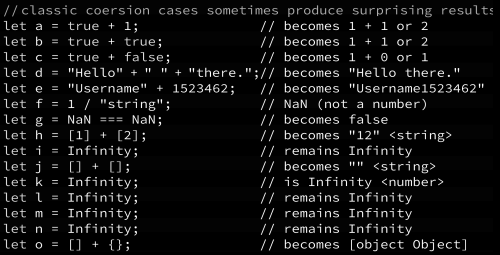

Source Code : 👉 https://github.com/sundharwinston/JavascriptGrammer/blob/main/views/chapter6/type-coercion.ejs

## Adding Multiple Values
Operator Precedence
Example : `1 + 1 + 1 + 2 * " "`

    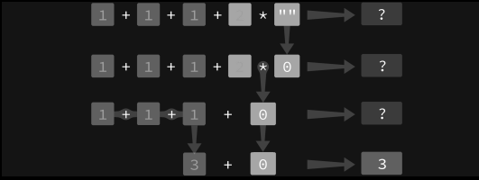

## String To Number Comparison
When it comes to equality operator == numeric strings are evaluated to numbers in the same way the Number(string) function evaluates to numbers (or NaN).

Eamples :

    1 ==  "1";          //true

    1 == "a";           //false
Note : If the string does not contain a numeric value, it will evaluate to NaN and therefore
further evaluating to false:

##  L-value and R-value
In many computer languages values on the left and right side of the operator are referred to as L-value and R-value.

`Assignment Operator :`
    The assignment operator takes the R-value and transfers it over to L-value, which is usually a variable identifier name.
`Arithmetic Addition Operator :`
    But the arithmetic addition operator takes the L-value and adds R-value to it:

## null vs undefined

<strong>Null:</strong> It is the intentional absence of the value. It is one of the primitive values of JavaScript.
The value null represents the intentional absence of any object value. It is one of JavaScript's primitive values and
is treated as falsy for boolean operations.
<strong>Undefined:</strong> It means the value does not exist in the compiler. It is the global object.

    isNaN(1 + null)      // false
    isNaN(1 + undefined) // true

- [null](#null)
- [undefined](#undefined)

Source Code : 👉 https://github.com/sundharwinston/JavascriptGrammer/blob/main/views/chapter6/null-undefined.ejs

## Scope

Scope is simply the area enclosed by {} brackets. But be careful not to confuse it with the identical empty object-literal syntax.

There are 3 unique scope types:

- The global scope
- block scope 
- function scope 

Each expects different things and has unique rules when it comes to variable definitions. Event callback functions follow the same rules as function scope, they are just used in a slightly different context. Loops can also have their own block-scope.

## Variable Definitions

Variables are case-sensitive. This means a and A are two different variables:

    let a = 1;
    let A = "Hi"
    console.log(a);     // 1
    console.log(A);     // Hi

if you tried to refer to a variable that wasn’t defined anywhere, you would generate a ReferenceError error "variable name is not defined":
    
    console.log(x);      // ReferenceError : x is not defined
    {
    } 

Example : 
    
    var data = 1;
    {
        console.log(data);      // 1
    }

Here data is defined in global scope. But it can also be accessed from an inner block-scope. Anything (even a function definition) defined in global scope becomes available anywhere in your program. The value propagates into all inner scopes.

When a variable is defined in global scope using var keyword, it also automatically becomes available as a property on window object.

`Hoisting :`

- If data was defined using var keyword inside a block-scope, it would be hoisted back to global scope! Hoisting simply means ”raised” or ”placed on top of”.

- Hoisting is limited to variables defined using var keyword and function name defined using function keyword.

- Variables defined using let and const are not hoisted and their use remains limited
only to the scope in which they were defined.

Example :

    console.log(data);
    {
        var data = 1;
    }
Variable data is hoisted to global scope. But the value of the hoisted variable is now undefined not 1. Only its name definition was hoisted.

`Function Name Hoisting :`

Hoisting also applies to function names. But variable hoisting always takes precedence. You can call a function in your code, as long as it is defined at some point later:

    check();                                                //Hello i'm function definition
    function check() {
        console.log("Hello i'm function definition");
    }
Note that the function was defined after it was called. This is legal in JavaScript. Just make sure you understand that it happened because of function name hoisting.

    var d = function() {
        console.log("Hello i'm function definition");
    }
It is possible to assign an anonymous function expression to a variable name.

This valid JavaScript code will not produce a function redefinition error. Thefunction will be simply overwritten by second definition

    function check() {
        console.log(1);
    }
    function check() {
        console.log(2);
    }
    check();                    // 2

Note : However, this is still perfectly valid code – no error is generated. Whenever you have two function defined using function keyword and they happen to share the same name, the function that was defined `last will take precedence`.

     var check =  function() {
        console.log("variable assignment");
    }
    function check() {
        console.log("normal funciton definition")
    }
    check();                                            // variable assignment

Note: The variable name will take precedence over function definitions even if it was defined prior to the second function definition with the same name.

## Variable Types

JavaScript is a dynamically-typed (Loosely typed) language.
The type of the variable (defined using var or let keyword) can be assigned and changed at any time during the run-time of your application, after it was already compiled by browser’s JavaScript engine

The keywords `var, let` and `const` do not determine the variable’s type. Instead, they determine how the variable can be used.
It can be `re-assigned` to another value during run-time? For example, `var and let can`, but `const can’t`.

`var :`
The var keyword is still with us from original specification. You should probably start using let and const instead. For the most part it is still available but only to support legacy code.

`let :`
let defines a variable but limits its use to the scope in which it was defined.
The developers prefer let keyword over var keyword, as it's an improvement over the var keyword. It helps us to assign the value or store it to some variable.

`const :`
const is the same as let but you can’t re-assign it to a new value once defined.

##  Scope Visibility Differences

`No Difference In Global Scope :`
When variables are defined in global scope there is no differences between var, let and const in terms of scope visibility.

    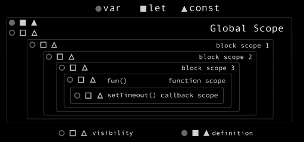

    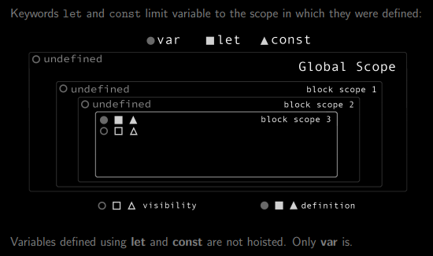

`Closures :`

## const and Arrays
Changing a value in the const array is still allowed:

    const a = [];
    a[0] = 1;
    console.log(a);     //1
    a = [];             //TypeError: Assignment to constant variable.
You just can’t assign any new objects to the original variable name again.

## const and Object Literals
Similar to arrays, when it comes to object literals, const only makes the definition constant.

    const a = {
        parameter1 : 1,
        parameter2 : 2
    }
    a.parameter1 = "change";
    console.log(a);                 // {parameter1: "change", parameter2: 2}

## Dos and Dont’s

Do not use var unless for some reason you want to hoist the variable name.(These cases are rare and usually don’t comply with good software design.)

Do use let and const instead of var, wherever possible. Variable hoisting (variables defined using var) can be the cause of unpredictable bugs, because only the variable name is hoisted, the value becomes undefined.

Do use const to define constants such as PI, speed of light, tax rate, etc. values that you know shouldn’t change during the lifetime of your application.

## Arithmetic

    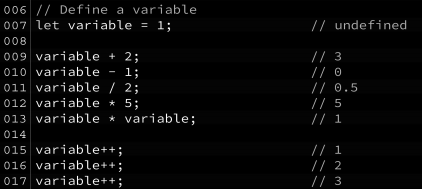

## Assignment

    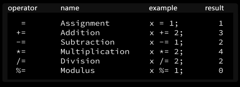

## String

Strings can be assigned to variable names or each other using the + operator which we earlier saw used as arithmetic addition. But when one or both of the values on either side of + operator are strings, it is treated as a string addition operator.

    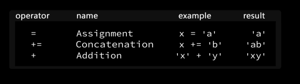

## Comparison

    

## Logical

    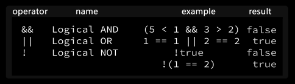

## Bitwise

    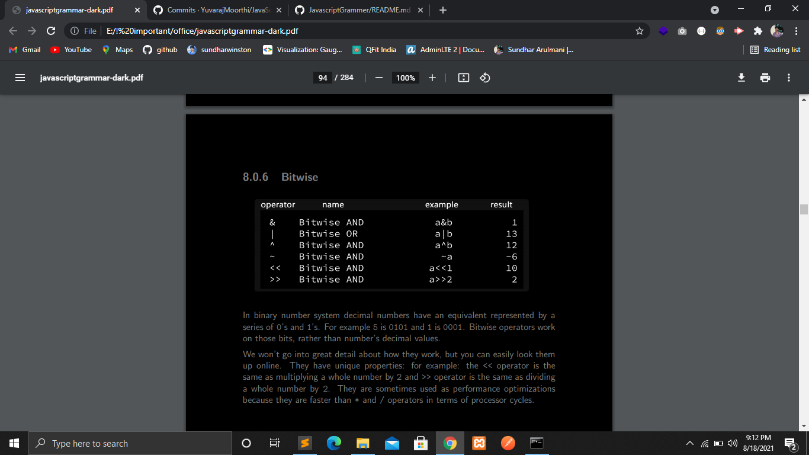

Bitwise have unique properties: for example: the << operator is the same as multiplying a whole number by 2 and >> operator is the same as dividing a whole number by 2. They are sometimes used as performance optimizations because they are `faster than * and / operators` in terms of processor cycles.

## typeof

    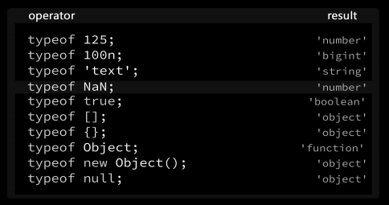

NaN lives natively on Number.NaN – it is considered to be a primitive value.

NaN is the symbol usually produced in the context of a numeric operation. One such example is trying to instantiate a number object by passing a string value to its constructor: new Number(”str”) in which case NaN would be returned.

## Ternary

The ternary operator has the form of: statement?statement:statement; Statements can be expressions or a single value:

    let data = statement ? value : value ;
The ternary operator is like an inline if-statement. It does not support {} brackets or multiple statements.

Source Code : 👉 https://github.com/sundharwinston/JavascriptGrammer/blob/main/views/chapter8/ternary.ejs

## delete   

The delete keyword can be used to delete an object property:
You cannot use delete to remove stand-alone variables. Even though, if you try to do that, no error will be generated (unless you are in strict mode.)

The delete statement is still allowed in strict mode, but some particular uses of it are erroneous. It's only allowed for object properties, not simple names, and only for object properties that can be deleted.

Source Code : 👉 https://github.com/sundharwinston/JavascriptGrammer/blob/main/views/chapter8/delete.ejs

## in

The in operator can be used to check if a property name exists in an object:

    "data" in {"name":"javascript", "data": "hello"}            // true
    "hello" in {"name":"javascript", "data": "hello"}           // false

The in operator, when used together with arrays, will check if an index exists.

    "data" in ["name",1,"data"];                // false
    0 in ["name",1,"date"];                     // true

Source Code : 👉 https://github.com/sundharwinston/JavascriptGrammer/blob/main/views/chapter8/in.ejs

## Rest Properties

The rest parameter syntax allows a function to accept an indefinite number of arguments as an array, providing a way to represent variadic functions in JavaScript.

<strong>Note:</strong> The rest parameter have to be the last argument, as its job is to collect all the remaining arguments into an array. So having a function definition like the code below doesn’t make any sense and will throw an error.

    // non-sense code
    function fun(a,...b,c){
        //code
        return;
    }

Source Code : 👉 https://github.com/sundharwinston/JavascriptGrammer/blob/main/views/chapter9/rest.ejs

## Spread Properties

Spread syntax (...) allows an iterable such as an array expression or string to be expanded in places where zero or more arguments or elements.

The values can be assigned to based on their index position.

    let arr = [3, 5, 1];
    alert( Math.max(...arr) );      // 5

We also can pass multiple iterables this way.

You can’t use ...spread syntax to assign values to variables.

    let a = [...arg];   
    let data = ...[1,2,3];     // Uncaught SyntaxError: Unexpected token '...'

`Merging arrays with ...spread :`

    let a = [1,2,3];
    let b = [4,5,6];
    console.log(...a,..b);          // 1 2 3 4 5 6

Source Code : 👉 https://github.com/sundharwinston/JavascriptGrammer/blob/main/views/chapter9/spread.ejs

`Spread & Rest Properties :`

The spread operator allows us to spread the value of an array (or any iterable) across zero or more arguments in a function or elements in an array (or any iterable). The rest parameter allows us to pass an indefinite number of parameters to a function and access them in an array.

When we see "..." in the code, it is either rest parameters or the spread syntax.

There’s an easy way to distinguish between them:

- When ... is at the end of function parameters, it’s “rest parameters” and gathers the rest of the list of arguments into an array.
- When ... occurs in a function call or alike, it’s called a “spread syntax” and expands an array into a list.

Use patterns:

- Rest parameters are used to create functions that accept any number of arguments.
- The spread syntax is used to pass an array to functions that normally require a list of many arguments.
Together they help to travel between a list and an array of parameters with ease.

## Destructuring Assignment

Destructuring assignment can be used to extract multiple items from arrays and objects and assign them to variables:

        [a,b] = [10,20];
        console.log(a);         // 10
        console.log(b);         // 20

` destructure into ...rest array :`

        [a,b,...rest] = [1,2,3,4,5,6,7];
        console.log(a,b);                           // 1 2
        console.log(rest);                          // [3,4,5,6,7]

`Destructuring` is often used to extract `object properties` to a `matching name`:

        let { data } = { data:1 };
        console.log(data);                  // 1

The order doesn’t matter
    
    let data = {
        first : 1,
        second : 2,
        third : 3,
    }
    let {second} = data;
    console.log(second);                    // 2
    let {third} = data;
    console.log(second + third)             //5

Source Code : 👉 https://github.com/sundharwinston/JavascriptGrammer/blob/main/views/chapter9/destructing-assignment.ejs

`Merging objects with ...spread :`

        let a = { p:1 ,q:2, m : () => {} };
        let b = { r:1 ,s:2, n : () => {} };
        let c = {...a ,...b };
        console.log(c);

## Closure Introduction

A closure is the combination of a function bundled together (enclosed) with references to its surrounding state (the lexical environment). In other words, a closure gives you access to an outer function’s scope from an inner function. In JavaScript, closures are created every time a function is created, at function creation time.

    function start(x) {
      return function(y) {
        return x + y;
      };
    }
    var sum = start(5);
    console.log(sum);                             // function of y i.e f(y){}
    console.log(sum(2));  // 7                    // It's a closure

Source Code : 👉 https://github.com/sundharwinston/JavascriptGrammer/blob/main/views/chapter10/closure.ejs

## Arity

Arity is the number of arguments a function takes.
You can access function’s arity via Function.length property:

    function function_name(a,b,c) {
    }
    let arity = function_name.length;
    console.log(arity);                         //3

## Currying

Currying is a technique of evaluating function with multiple arguments, into sequence of functions with single argument.In other words, when a function, instead of taking all arguments at one time, takes the first one and return a new function that takes the second one and returns a new function which takes the third one, and so forth, until all arguments have been fulfilled.

Source Code : 👉 https://github.com/sundharwinston/JavascriptGrammer/blob/main/views/chapter10/currying.ejs

## Loops

The primary purpose of a loop is to iterate over one or a set of multiple statements. . Iterating is commonplace in software development – it means to repeat an action a multiple number of times.`Array is an iterable. Object is not (objects are enumerable).`

## Types of loops in JavaScript

Common iterators are `for, for...of, for...in, while and Array.forEach`.
Some Array methods are assumed to be iterators: `.values,.keys, .map, .every, .some, .filter, .reduce` and a few others.They are called higher-order functions, because they take another function as an argument

`Incrementing And Reducing :`

Loops can be used for filtering out objects and reducing the list to something more meaningful.

    let data = [1,2,3,4];
    let sum = 0;
    for(let i = 0 ; i < 3 ; i++){
        sum += data[i];
    }
    console.log(sum);

You can implement a reducer to the same effect:

    let data = [1,2,3,4];
    const function_variable = (accumulator,value) => accumulator + value ;
    const result = data.reduce(function_variable);
    console.log(result);

## for loops
`syntax :`

    for(initialize; condition; increment/decrement){
        //multiple statements
    }

`The Infinite for Loop :`

    for(;;)
        console.log("Hey javascript !");    

`Multiple Statements :`

`Note :` the combination of the two statements: i++, inc().

        let counter = 0;
        function increment(){ counter++; }
        for(let i = 0; i<5; i++,increment()){
            console.log(counter);
        }

`for loops and let scope :`

    for(let i = 0; i<5; i++) let x=i;          //Error: Lexical declaration cannot appear in single-statement context

`Breaking To Label :`

        let c = 0;
        mark : for( let i=0; i<5; i++){
            c++;
            inner : for(let j=0; j < 5 ; j++){
                if( i == 1 )
                break mark;
            }
        }
        console.log(c);                                     // 2

`Breaking from a labeled block scope :`

        block : {
            console.log("before");
            break block;
            console.log("after");
        }                                                   // before

Source Code : 👉 https://github.com/sundharwinston/JavascriptGrammer/blob/main/views/chapter11/for.ejs

## for...of Loop

syntax :

    for (variable of iterable) {
      statement
    }

Example :
    
    const iterable = [10, 20, 30];
    for (const value of iterable) {
      console.log(value);
    }    

`for...of and Generators :`
    
    function* name([param[, param[, ... param]]]) {
        Statements
    }

    name.next().value();                //generator calling method

`for...of and Strings :`
You can walk each character of a string using a for...of loop:

    let text = "javascript";
    for (const value of text) {
      console.log(value);
    }    

`for...of and Arrays :`
We can `iterate through it without having to create index variables`. Once the end of the array is reached the loop will end automatically.

    let array = [1,2,3,4];
    for (const value of array) {
      console.log(value);
    }  

` for...of and Objects :`
for...of loops work only with iterable values. An object is not an iterable.

    let obj = { a : 1, b : 2, c : 3, d :4 };
    for (const value of obj) {
      console.log(value);
    }                                       // Error : obj is not iterable

`for...of loops and objects converted to iterables :`

    let data = { prop : 1 , method : () => {} };
    for( let key of Object.keys(data))
        console.log(key);
        //
    for( let value of Object.values(data))
        console.log(value);

for-of Source Code : 👉 https://github.com/sundharwinston/JavascriptGrammer/blob/main/views/chapter11/for-of.ejs

## for...in Loops

The for...of loops won’t be help for object iteration

The for/in statement loops through the properties of an object.
The block of code inside the loop will be executed once for each property.

    let object = {
        a : 1, b: 2, c:3,
    };
    for(let value in object){
        console.log(value, object[value]);
    }
    
Source Code : 👉 https://github.com/sundharwinston/JavascriptGrammer/blob/main/views/chapter11/for-in.ejs

## While Loops

syntax : 
    
     while(syntax){
        //statements
     }

<h1>Chapter 12 : Arrays</h1>

## Array
Many of the Array.* methods are iterators.
Array methods are attached to Array.prototype property. This means you can execute them directly from array object like array.forEach() or directly from array’s literal value like: [1,2,3].forEach();

## Array.prototype.sort()

The sort() method sorts the elements of an array in place and returns the sorted array. The default sort order is ascending, built upon converting the elements into strings, then comparing their sequences of values.

The time and space complexity of the sort cannot be guaranteed as it depends on the implementation.

    const array1 = [4,6,5,1,2,3];
    array1.sort();
    console.log(array1);

<strong>Note :</strong>The sorted array. Note that the array is sorted in place, and `no copy is made.`

Source Code : 👉 https://github.com/sundharwinston/JavascriptGrammer/blob/main/views/chapter12/sort.ejs

## Array.forEach

The forEach method will execute a function for every item in the array.
Each iteration step receives 3 arguments `value, index, object.`

Source Code : 👉 https://github.com/sundharwinston/JavascriptGrammer/blob/main/views/chapter12/foreach.ejs

## Array.every

    Return value: boolean

The every() method tests whether all elements in the array pass the test implemented by the provided function.

Source Code : 👉 https://github.com/sundharwinston/JavascriptGrammer/blob/main/views/chapter12/every.ejs

## Array.some
    Return value: boolean

The some() method tests whether `at least one element in the array passes the test` implemented by the provided function. 

Source Code : 👉 https://github.com/sundharwinston/JavascriptGrammer/blob/main/views/chapter12/some.ejs

##  Array.filter

    Return value : new array consisting only of items that passed a condition.

- The filter() method creates a new array with all elements that pass the test implemented by the provided function.
- filter() does not change the original array.

Source Code : 👉 https://github.com/sundharwinston/JavascriptGrammer/blob/main/views/chapter12/filter.ejs

## Array.map

    Return value: a copy of the original array with modified values (if any.)

- The map() method calls the provided function once for each element in an array, in order.
- map() does not change the original array.

Source Code : 👉 https://github.com/sundharwinston/JavascriptGrammer/blob/main/views/chapter12/map.ejs

## Array.reduce

    Return value: accumulator

##  Dos and Dont’s

- Do use it for summing up some numbers.
- Do use it for multiplying some numbers.
- Do use it for updating state in React.
- Do not use it for building new lists or objects from scratch.
- Do not use it for just about anything else (use a loop).
- Do not use it to mutate (change original values of) its arguments.
- Do not use it perform side effects, like API calls and routing transitions.

## Array.flat()

The flat() method creates a new array with all sub-array elements concatenated into it recursively up to the specified depth.

    const arr1 = [0, 1, 2, [3, 4]];
    console.log(arr1.flat());

    const arr2 = [0, 1, 2, [[[3, 4]]]];
    console.log(arr2.flat(2));                  //sub array count

Source Code : 👉 https://github.com/sundharwinston/JavascriptGrammer/blob/main/views/chapter12/flat.ejs

Examples of `map()` and `flatMap()`

    let arr1 = [1, 2, 3, 4];
    arr1.map(x => [x * 2]);                         // [[2], [4], [6], [8]]
    arr1.flatMap(x => [x * 2]);                     // [2, 4, 6, 8]
    arr1.flatMap(x => [[x * 2]]);                   // [[2], [4], [6], [8]]

## String.prototype.matchAll()
String.match with string argument only returns the first match. for example :

    let string = "Hello";
    let match = string.match('l');              // ["l", index: 2, input: "Hello", groups: undefined]
    console.log(match[0]);                      // l

`Adding /g to the mix :`

    let string = "Hello";
    let match = string.match(/l/g);
    console.log(match);                              // (2) ["l", "l"]

## Dos and Dont’s
- Do use string.matchAll instead of regex.exec & string.match with /g flag.

## Comparing Two Objects

e == and === operators won’t help because they compare by reference and not by value

    [] === [];                      //false
    let x = []; 
    x === x;                        //true

When the compared objects have a lot of properties or the structure of the objects is determined during runtime, a better approach is to use shallow check.

Finally, if the compared objects have nested objects, the deep equality check is the way to go.

Source Code : 👉 https://github.com/sundharwinston/JavascriptGrammer/blob/main/views/chapter12/compare-object.ejs

## Writing arrcmp

JavaScript provides a function JSON.stringify() in order to convert an object or array into JSON string. By converting into JSON string we can directly check if the strings are equal or not.

Source Code : 👉 https://github.com/sundharwinston/JavascriptGrammer/blob/main/views/chapter12/compare-array.ejs

## Functions

two types of functions: 
- the standard function that can be defined using function keyword 
    - The name of the function.
    - A list of parameters to the function, enclosed in parentheses and separated by commas.
    - The JavaScript statements that define the function, enclosed in curly brackets, {...}
Syntax : 
                
        function functionName(parameter) {
            //........statements
        }

- Arrow function 
Syntax :
    
        (parameter)=>{
            //........statements
        } 

## Parameter Vs Arguments :

    

Source Code : 👉

## Anonymous Functions
If The function name is omitted then the function is called as Anonymous function. for example.

    setTimeout(function(){
        console.log("hello Javascript");
    },1000)

## Assigning Functions To Variables
Anonymous functions can be assigned to a variable. If you assigned a anonymous function to a variable then it is also called as named function and you can call the function using their variable for example.

    let functionVariable = function(){
        console.log("Hey i am anonymous function");
    }
    functionVariable();                                 // functin call

You can also pass them to the event functions just by their name.
    
    setTimeout(functionVariable,1000);

Source Code : 👉

## Origin of this keyword
this keyword was meant to point to an instance of an object in class definitions.

Source Code : 👉

## higher-order function

## Intro
A higher-order function is a function that accepts functions as parameters and/or `returns a function.`The first-order function actions also applies on higher order function.

## Iterators

The Array.map method is one of the most common higher-order functions. It takes a function to run on every item in the array. Then it returns a modified copy of the original array.

Instead of writing and re-writing a lot of repetitive code. But map,filter,reduce(Higher Order function) makes your code look cleaner.

writing our own map method we now actually understand how it works internally.check it out bellow source code for better understanding.
Higher order map function source code : 👉

## Dos and Dont’s

- Do use a high-order method for solving the problems it was intended to solve.
- Understanding the differences between map, filter, reduce matters. This isn’t about just the syntax differences, but `writing efficient` code and `avoiding antipatterns.`
- `Do not use filter` if you can get away with using `reduce` to accomplish the same action with more efficiency.

## Arrow Functions

Arrow functions were introduced in ES6.
Instead of defining the function using the function keyword, we can use arrow functions. 

Syntax :

    () => {}                                    // Arrow function syntax
    let data = () => {}.                        // Assigning arrow function to variable
    data();                                     // call arrow function
    let data = () => { return 1; }              // return a value
    let data = () => 1                          // this is also a return type of value

## Dynamic HTML

The element is not typed directly into your HTML document using HTML tag syntax. Instead, it is created dynamically by your application.
The method createElement natively exists on the document object. It can be used to create a new element.

    let div = document.createElement("div");                           // create div
    let span = document.createElement("span");                          
    let img = document.createElement("img");                           
    let p = document.createElement("p");                                

When adding a new HTML element dynamically, it is usually inserted into another element that already exists in the DOM.

##  Setting CSS Style

We can assign a css syle properties to the dynamic html elements.

    let div = document.createElement("div");                    // create element
    div.setAttribute("id","element");                           // set id to the element
    div.setAttribute("class","border");                         // set class name to the element
    div.style.top = 100px;                                      // assigning css via style property
    div.style.bottom = 100px;
    div.style.color = "black";

Important Note: 

In CSS dash (-) is a legal property name character. But in JavaScript it is always interpreted as the minus sign. Using it as part of a JavaScript identifier name will cause an error. For this reason, single-word CSS property names remain the same – style.position and style.display for example. `Multi-word property names are changed to camel-case format`, where the second word is capitalized. `For example z-index becomes .zIndex, and border-style becomes .borderStyle.`

## Adding-Elements-To-DOM
## Adding Elements To DOM with .appendChild method

Method element. appendChild(object ) inserts an element object into DOM.

`document.body :`

    document.body.appendChild( div );                 // Add element to the dom by inserting it  into <body> tags

`getElementById :`

Insert element into another element by id:

    document.getElementById("id").appendChild( div );

`querySelector :`

The Document method querySelector() returns the first Element within the document that matches the specified selector, or group of selectors. If no matches are found, null is returned.

    var element = document.querySelector("p");              // return first paragraph tag

## Writing A Function To Create Elements

Writing your own functions is fun. And sometimes necessary. In this section we will write our own function that makes it easy to create HTML elements dynamically.

`Function Parameters :`

    let element = (id,right,left,bottom,color) => {             // function parameter
        // body of the function
    }
    element('id-1',10,1,100,'black');                           // functionn invocation

Bellow are UI elements pixel-perfect precision.

    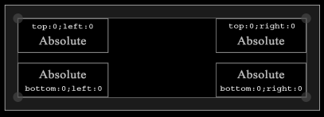

## Creating objects using function constructors

    function lang(name) {                            // function definition
        this.name = name;
        this.prg = function() {
            return this.name;
        }
    }
    let js = new lang('javascript');                // initiate object
    let java = new lang('java');

In JavaScript programs Objects and Arrays are created all the time. Imagine if you instantiated 10000 or even 100000 objects of a particular type, each storing a copy of the same exact method. This is rather wasteful. Instead of using this we can use Native functions like Array.toString().

## Prototype

whenever you create any object the javascript engine automatically put this hidden properties into an object and attaches to an object.

When a function is defined two things happen:

1.The function object is created, because functions are objects. 
2.A completely separate prototype object is created. The prototype property of the defined function will point to it.

Note :
- No matter how many objects you create, functions are loaded only once into memory.
- Allows you to override function if required.
- A JavaScript prototype is used to add new properties and methods to an existing object constructor.

Let’s say we defined a new function Human:
    
    function Human() {}
    console.log( typeof Human.prototype )                  // object

`Human.prototype` will point to the prototype object. This object has another property called constructor, which points back to the Human function:

    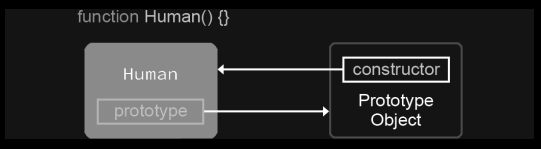

`Human is a constructor function, used to create objects of type Human. Its prototype property points to a separate entity in memory: prototype object. There is one separate prototype object per each unique object type (class).
`

##  Prototype on Object Literal

object literal :

    let literal =  {
        name : "javascript",
        age : 1990,
        method : function() {}
    }
    console.log(typeof literal.__proto__);                      // object

Internally it is wired into prototype as an object of type Object, even though it wasn’t created using the new operator.

When literal was created, literal. proto was wired to point to Object.prototype. Object.prototype was already created internally by JavaScript

    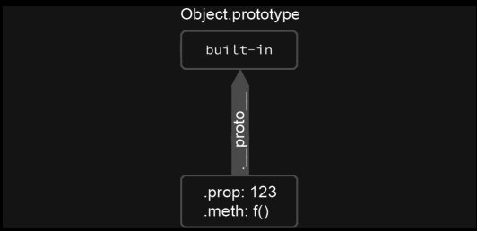

##  Prototype Link

When an object is instantiated using new keyword, the constructor function executes to build the instance of that object.

    let instance = new Object();
    instance.prop = 123;
    instance.method = function() {}

In this case Object constructor function is executed and we get a constructed link, that looks like this:

##  Prototype Chain

It can be argued that Array is a child of its parent type Object.

## Creating objects 

In JavaScript we can also create objects using Object.create method, which takes a clean slate object as one of its arguments.

    const language = {
        name : "javascript",
        age : 1990 ,
    }
    let programming = Object.create(language);
    programming.otherName = "child java";
    programming.message = "hi";
    console.log(programming);
    console.log(programming.age);

Here the JavaScript will look at .age property in language object. Because programming was created via Object.create(language), programming considers language to be its parent so it looks there. Finally it finds it on language.age and returns 1 in console. Again, property hunger is stored only once in memory.

## Object Oriented Programming

https://blog.sessionstack.com/how-javascript-works-3-types-of-polymorphism-f10ff4992be1
https://www.simplilearn.com/tutorials/javascript-tutorial/oop-in-javascript#class_implementation_in_javascript

https://www.youtube.com/watch?v=ZYa_NiOUTQo&list=PLhW3qG5bs-L9MspCEDoTa4TuGJ3K9k9F_&index=22

There are three ways to create an object 
- By onject literal
- Uisng new keyword
- Using an object constructor

## Inheritance

`Types of Inheritance in JavaScript :`

Inheritance is an important concept in object oriented programming. In the classical `inheritance, methods from base class get copied into derived class`. In JavaScript, inheritance is supported by using prototype object. Some people call it "Prototypal Inheriatance" and some people call it "Behaviour Delegation".

## Prototypal Inheritance

## Pseudoclassical Inheritance
## Functional Inheritance

## Polymorphism and Encapsulation
## Types of Polymorphism

## Ad-hoc Polymorphism
## Parametric Polymorphism
## Subtype Polymorphism
## Polymorphism, Why Use it?

## Events

Events are functions executed at the time when a specific action occurs.
There are two types of events:
- browser events 
- synthetic events

## Browser Events

Built-in browser events are already pre-determined and executed by the browser when an action occurs. For example :  onmousemove event

## Synthetic Events

Events created in this way are called synthetic events because they are not generated by the browser itself, but rather by your program.

Let’s create a synthetic event :
    
    let startEvent = new Event('start');
    document.addEventListener('start', function() {
        <!-- your code -->
    },false);

## Event Capture And Event Bubbling

## setTimeout

The setTimeout() function is actually exposed by the browser's window object as as such they aren't necessarily defined in the ECMAScript specification because `they're not JavaScript features, they are features of the browser itself.`

You can time events using setTimeout function.

    setTimeout(function,time);

Resetting the timeout using clearTimeout function will cancel the event and prevent it from occurring in the future.
    
    let timer = setTimeout(functionCall,1000);
    clearTimeout(timer);
    timer = null;

## setInterval

The setInterval function works exactly like setTimeout, except `it will continue executing the callback function` for an indefinite number of times at a time interval specified as its second argument.

    let interval = setInterval(functionCall,1000);
    

##  Intercepting Browser Events

Many built-in events already have callback functions attached to global window object. This means you can override them by providing your own version.

    window.onload = function (event) {}
    window.focus = function (event) {}
    window.onmouseover = function (event) {}

 It is possible to attach events directly to HTML elements. And if the selected element supports a particular event type, it will be overwritten.

    document.getElementById('id').onClick = function (event) {
        console.log(event);
    }

## Network Requests

Applications dealing with back-end code often communicate via HTTP requests.

## XMLHttpRequest

XMLHttpRequest is a built-in browser object that allows to make HTTP requests in JavaScript.

Right now, there’s another, more modern method fetch, that somewhat deprecates XMLHttpRequest.

In modern web-development XMLHttpRequest is used for three reasons :

- Historical reasons: we need to support existing scripts with XMLHttpRequest.
- We need to support old browsers, and don’t want polyfills (e.g. to keep scripts tiny).
- We need something that fetch can’t do yet, e.g. to track upload progress.

HTTP status code :
- `OK` for 200, 
- `Not Found` for 404,
- `Forbidden` for 403 and so on.

## Promises

Promises are used to handle asynchronous operations in JavaScript. They are easy to manage when dealing with multiple asynchronous operations where callbacks can create callback hell leading to unmanageable code.

`Benefits of Promises :`
- Improves Code Readability
- Better handling of asynchronous operations
- Better flow of control definition in asynchronous logic
- Better Error Handling

    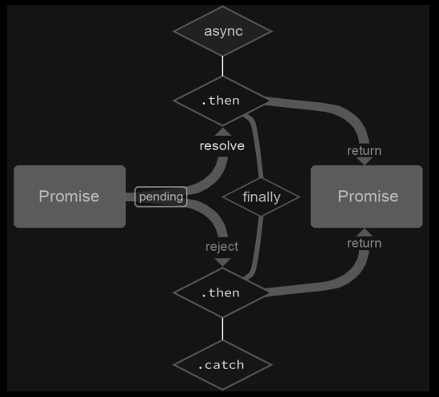

Syntax :

    var promise = new Promise(function(resolve, reject){
     // write logics here
    });

Parameters :
- Promise constructor takes only one argument,a callback function.
- Callback function takes two arguments, resolve and reject
- Perform operations inside the callback function and if everything went well then call resolve.
- If desired operations do not go well then call reject.

Promise Consumers
Promises can be consumed by registering functions using .then and .catch methods.

`then()`
then() is invoked when a promise is either resolved or rejected.

`syntax :`
    
    .then(function(result){
        //handle success
    }, function(error){
        //handle error
    })

`catch()`

catch() is invoked when a promise is either rejected or some error has occured in execution.

Syntax :

    .catch(function(error){
        //handle error
    })

`finally()`

The finally method is executed regardless of whether event succeeded with resolve method or failed with reject method. It is a good place for cleaning up the code or update the UI view

Example :

        promise.finally(function(msg) {
            console.log("finally: hide the loading animation")
        });

`Promise Applications :`

- Promises are used for asynchronous handling of events.
- Promises are used to handle asynchronous http requests.

## Axios

- Axios is a promise based HTTP client for the browser and Node.js. Axios makes it easy to send asynchronous HTTP requests
- Axios is to generage requests in JavaScript using Axios client library. The JavaScript fetch method for an alternative way of creating requests in JavaScript.

## Fetch API

- The built-in fetch API offers another Promise-based interface for talking to a web server.
- The Fetch API provides a JavaScript interface for accessing and manipulating parts of the HTTP pipeline, such as requests and responses. It also provides a global fetch() method that provides an easy, logical way to fetch resources asynchronously across the network.

The fetch specification :

- The Promise returned from `fetch() won’t reject on HTTP error status even if the response is an HTTP 404 or 500.`Instead, as soon as the server responds with headers, the Promise will resolve normally and it will `only reject on network failure` or if anything prevented the request from completing.
- fetch() won’t send cross-origin cookies unless you set the credentials init option. 

## async await

Async functions :
- The `async` keyword. It can be placed before a function, example look bellow.
            
        async function f() {
            return 1;
        }

- The word `async` before a function means one simple thing: a function always returns a promise. Other values are wrapped in a resolved promise automatically.

Await :

- The keyword await makes JavaScript wait until that promise settles and returns its result.
    
        let value = await promise;

we cannot return the data in async function that is, return type of async function is only on `promise` after that we can get a data using `.Then` method.

without using `.then` we can use `await` and get a data inside a async function.

## Generator

## Event Loop

JavaScript has a concurrency model based on an event loop, which is responsible for executing the code, collecting and processing events, and executing queued sub-tasks. This model is quite different from models in other languages like C and Java.

    

    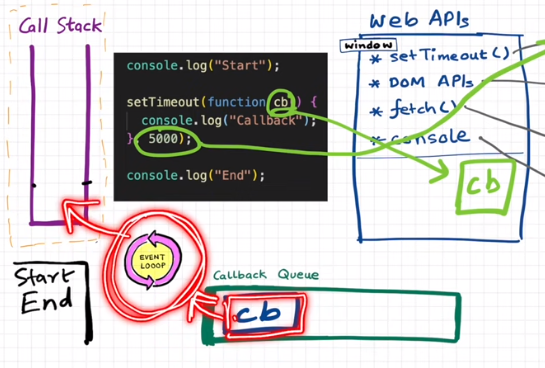

    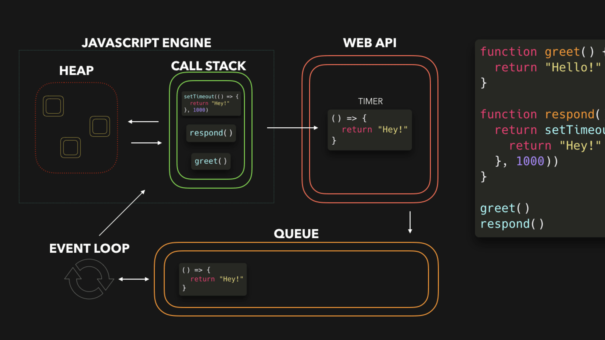

## Call Stack

- The call stack is a place to keep track of currently executing functions. As your code executes, each call is placed on the call stack in order in which it appears in your program. Once the function returns it is removed from the call stack.

- Placing a function call onto the stack is called pushing and removing it from the call stack is called popping. Same idea behind Array.push and .pop methods

## Execution Context

Everything in javascript happen inside an Execution Context.

In JavaScript, execution context is an abstract concept that holds information about the environment within which the current code is being executed.

Remember: the JavaScript engine creates the global execution context before it starts to execute any code.

    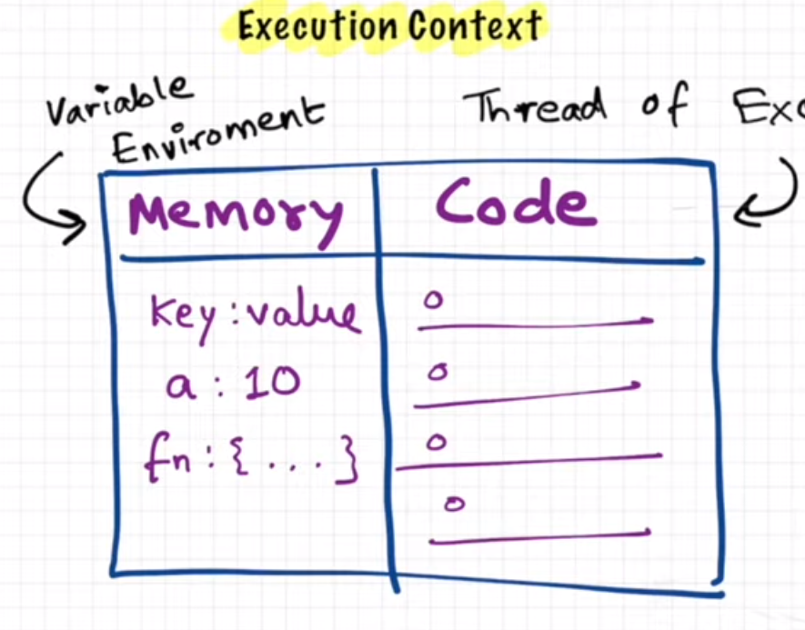

    

    

    

## call method
## call, apply and bind

call and apply :
The call() method calls a function with a given this value and arguments provided individually.

call() and apply() serve the exact same purpose. The only difference between how they work is that call() expects all parameters to be passed in individually, whereas apply() expects an array of all of our parameters. Example:

The main differences between bind() and call() is that the call() method:
- Accepts additional parameters as well
- Executes the function it was called upon right away.
- The call() method does not make a copy of the function it is being called on.

## Bind

The bind() method creates a new function that, when called, has its this keyword set to the provided value. 